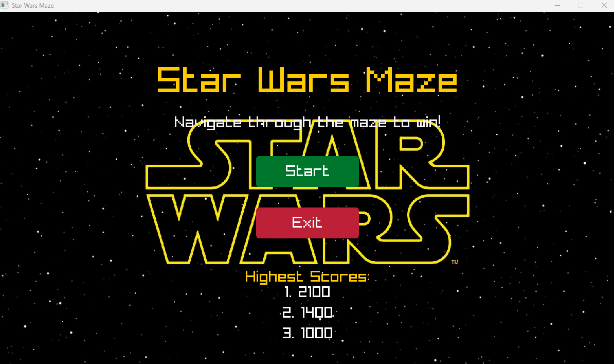
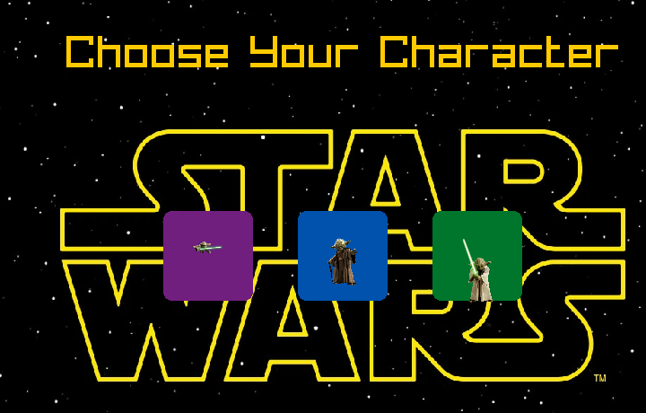

# Star-Wars-Maze
 # 🧩 C++ Maze Game 🎮  

Welcome to the **C++ Maze Game** repository! This project showcases the journey of developing a dynamic maze game with exciting features like randomly generated enemies, weapons, and advanced logic for balanced gameplay.  

---

## 🚀 Features  
- **Advanced Maze Generator**: Adds complexity and variety to each playthrough.  
- **Randomly Moving Enemies**: Dynamic challenges that make the game more engaging.  
- **Randomly Generated Weapons**: Strategize and defend yourself!  
- **Advanced Logic System**: Balances randomness with fairness, ensuring players have a chance to survive.  

---

## 🎥 Screenshots  

### 🎮 Gameplay Screenshot 1:  
  

### 🎮 Gameplay Screenshot 2:  
  

---

## 💡 What I Learned  
- How to design and refine algorithms.  
- Collaboration and problem-solving in a team.  
- Balancing randomness with logic for a better gaming experience.  

---

## 🚀 Getting Started  

1. Clone the repository:  
   ```bash
   git clone https://github.com/AbdoKujo/Star-Wars-Maze.git

